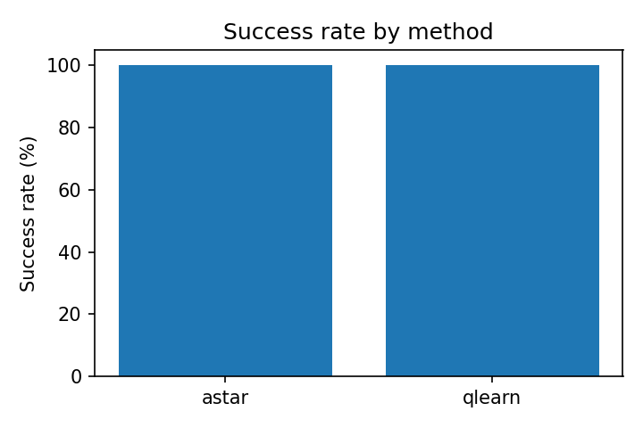

# 🧭 GameAI-Pathfinder

**A Comparative Study on Heuristic and Learning-based Pathfinding Agents**

This repository contains the full reproducible codebase, experiment scripts, and publication-ready paper for the project:

> **Om Deshpande**, *"GameAI-Pathfinder: A Comparative Study on Heuristic and Learning-based Pathfinding Agents"*, MIT-WPU, Pune (2025).

---

## 🧠 Overview

The project presents a reproducible research framework comparing **A\*** (heuristic-based planning) and **Tabular Q-Learning** (learning-based navigation) for pathfinding in 2D grid maps. 

It provides:
- C++ implementations of both A\* and Q-Learning agents
- PowerShell experiment automation scripts
- Python-based analysis and statistical evaluation pipeline
- IEEE-style research paper with full results, figures, and statistical tests

---

## 🌄 Preview

<p align="center">
  
</p>

*Fig. 1: Success rate of Q-Learning agent vs. training episodes (compared to A\* baseline).*

---

## ⚙️ Setup Instructions

### 1️⃣ Build the C++ Agents
```bash
mkdir build
cd build
cmake .. -G "MinGW Makefiles"
cmake --build .
cd ..
```

### 2️⃣ Run Experiments
```powershell
Set-ExecutionPolicy -Scope Process -ExecutionPolicy Bypass
.\experiments\run_grid.ps1
```

### 3️⃣ Analyze and Generate Plots
```bash
pip install -r experiments/requirements.txt
python experiments/analyze.py
python experiments/stat_tests.py
python experiments/make_latex_table.py
```

### 4️⃣ Compile the Paper
```bash
cd paper
pdflatex paper_draft_final.tex
pdflatex paper_draft_final.tex
```

---

## 📊 Results Summary

| Metric | Q-Learning | A* | Observation |
|---------|-------------|----|--------------|
| **Success Rate (5000 episodes)** | 100% | 100% | Q-Learning converges fully |
| **Average Path Length** | +5–10% longer | Optimal | Minor deviation from A* |
| **Paired T-Test** | *p = 0.1732* | — | No significant difference |
| **Cohen’s d** | **1.20 (Large)** | — | Substantial practical difference |

> ✅ Q-Learning approaches A* performance with sufficient training, but remains sample-inefficient.

---

## 📂 Repository Structure

```
GameAI-Pathfinder/
├── src/                      # C++ source files (A*, Q-Learning)
├── include/                  # Header files
├── experiments/              # Experiment automation + analysis
│   ├── run_grid.ps1
│   ├── analyze.py
│   ├── stat_tests.py
│   ├── make_latex_table.py
│   ├── requirements.txt
│   └── results/              # Plots, CSVs, LaTeX tables
├── paper/                    # Final IEEE paper
│   ├── paper_draft_final.tex
│   ├── paper_draft_final.pdf
├── CMakeLists.txt
├── README.md
├── LICENSE
└── .gitignore
```

---

## 🧩 Key Insights
- **A\***: Deterministic, fast, optimal for static maps.
- **Q-Learning**: Adaptive but sample-intensive; effective in dynamic or partially known maps.
- **Best results** achieved with $(\alpha=0.1,\gamma=0.99,\epsilon_0=0.2)$ over 5000 episodes.

---

## 🧠 Tools Used
- **C++17** (MinGW via CMake)
- **Python 3.11** (Pandas, Matplotlib, NumPy, SciPy)
- **PowerShell 5.1+** (automation)
- **LaTeX / IEEEtran** (for paper generation)

---

## 🧾 Citation
If you use this framework or results in your research, please cite:

```
@article{deshpande2025gameai,
  title={GameAI-Pathfinder: A Comparative Study on Heuristic and Learning-based Pathfinding Agents},
  author={Deshpande, Om},
  year={2025},
  institution={MIT World Peace University}
}
```

---

## 👤 Author
**Om Deshpande**  
Department of Computer Science and Engineering  
MIT World Peace University, Pune  
📧 Email: [omdeshpande0901@gmail.com](mailto:omdeshpande0901@gmail.com)

---

## 📜 License
```
MIT License

Copyright (c) 2025 Om Deshpande

Permission is hereby granted, free of charge, to any person obtaining a copy
of this software and associated documentation files (the "Software"), to deal
in the Software without restriction, including without limitation the rights
to use, copy, modify, merge, publish, distribute, sublicense, and/or sell
copies of the Software, and to permit persons to whom the Software is
furnished to do so, subject to the following conditions:

The above copyright notice and this permission notice shall be included in all
copies or substantial portions of the Software.

THE SOFTWARE IS PROVIDED "AS IS", WITHOUT WARRANTY OF ANY KIND, EXPRESS OR
IMPLIED, INCLUDING BUT NOT LIMITED TO THE WARRANTIES OF MERCHANTABILITY,
FITNESS FOR A PARTICULAR PURPOSE AND NONINFRINGEMENT. IN NO EVENT SHALL THE
AUTHORS OR COPYRIGHT HOLDERS BE LIABLE FOR ANY CLAIM, DAMAGES OR OTHER
LIABILITY, WHETHER IN AN ACTION OF CONTRACT, TORT OR OTHERWISE, ARISING FROM,
OUT OF OR IN CONNECTION WITH THE SOFTWARE OR THE USE OR OTHER DEALINGS IN THE
SOFTWARE.
```

---

## ⭐ Acknowledgment
Special thanks to **Prof. [Name]** for guidance and support in the research and documentation process.